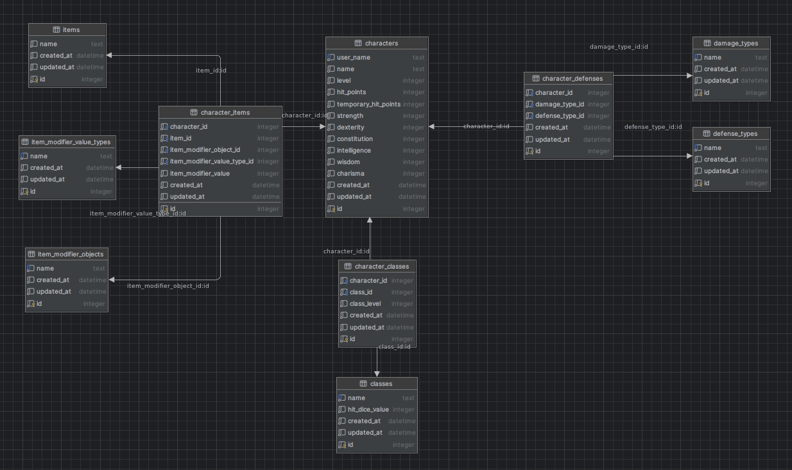

# DDB Back End Developer Challenge

## Solution

### About

This project is built with Nest.js, Prisma + SQLite and Jest for testing. Although it's a bad practice but the database path is hardcoded so no environment variables are needed. 

### Running the project

1. Clone the repository
2. From the `backend` directory run `npm install`
3. Run `npm run start:dev`
4. The server will be running on `http://localhost:3000`

### Endpoints
- GET `/characters/briv` - Get character information
- POST `/characters/briv/damage` - Body ex.: `{"amount": 5; "type": "fire"}` Deal damage to the character
- POST `/characters/briv/heal` - Body ex.: `{"amount": 10}` Heal the character
- POST `/characters/briv/temporary-hp` - Body ex.: `{"amount": 5}` Add temporary HP to the character

### Testing
- Run `npm run test` to run the tests

### Database

Data is stored in an SQLite db located in `backend/prisma/dev.db`. Table creation sql script as well as data seeding sql script is located in `backend/prisma/migrations` directory. ERD is shown below.

---

### Overview
This task focuses on creating an API for managing a player character's Hit Points (HP) within our game. The API will enable clients to perform various operations related to HP, including dealing damage of different types, considering character resistances and immunities, healing, and adding temporary Hit Points. The task requires building a service that interacts with HP data provided in the `briv.json` file and persists throughout the application's lifetime.

### Task Requirements

#### API Operations
1. **Deal Damage**
    - Implement the ability for clients to deal damage of different types (e.g., bludgeoning, fire) to a player character.
    - Ensure that the API calculates damage while considering character resistances and immunities.

    > Suppose a player character is hit by an attack that deals Piercing damage, and the attacker rolls a 14 on the damage's Hit Die (with a Piercing damage type). `[Character Hit Points - damage: 25 - 14 = 11]`

2. **Heal**
    - Enable clients to heal a player character, increasing their HP.

3. **Add Temporary Hit Points**
    - Implement the functionality to add temporary Hit Points to a player character.
    - Ensure that temporary Hit Points follow the rules: they are not additive, always taking the higher value, and cannot be healed.

    > Imagine a player character named "Eldric" currently has 11 Hit Points (HP) and no temporary Hit Points. He finds a magical item that grants him an additional 10 HP during the next fight. When the attacker rolls a 19, Eldric will lose all 10 temporary Hit Points and 9 from his player HP.

#### Implementation Details
- Build the API using either C# or NodeJS.
- Ensure that character information, including HP, is initialized during the start of the application. Developers do not need to calculate HP; it is provided in the `briv.json` file.
- Retrieve character information, including HP, from the `briv.json` file.

#### Data Storage
- You have the flexibility to choose the data storage method for character information.

### Instructions to Run Locally
1. Clone the repository or obtain the project files.
2. Install any required dependencies using your preferred package manager.
3. Configure the API with necessary settings (e.g., database connection if applicable).
4. Build and run the API service locally.
5. Utilize the provided `briv.json` file as a sample character data, including HP, for testing the API.

### Additional Notes
- Temporary Hit Points take precedence over the regular HP pool and cannot be healed.
- Characters with resistance take half damage, while characters with immunity take no damage from a damage type.
- Use character filename as identifier

#### Possible Damage Types in D&D
Here is a list of possible damage types that can occur in Dungeons & Dragons (D&D). These damage types should be considered when dealing damage or implementing character resistances and immunities:
- Bludgeoning
- Piercing
- Slashing
- Fire
- Cold
- Acid
- Thunder
- Lightning
- Poison
- Radiant
- Necrotic
- Psychic
- Force

If you have any questions or require clarification, please reach out to your Wizards of the Coast contact, and we will provide prompt assistance.

Good luck with the implementation!
